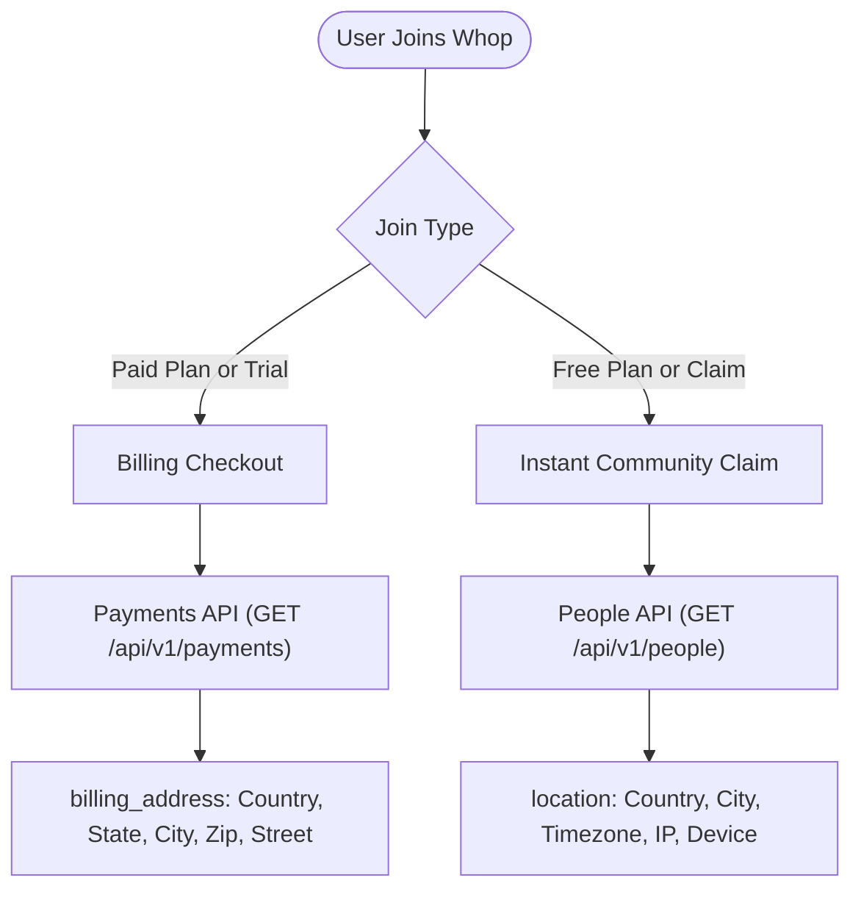

# 🌍 Whop Member Data & Location Tracking SOP

This directive documents how customer identity, location, demographics, and membership lifecycle data are structured and retrieved across the Whop API and Dashboard.

---

## 1. Overview: The Two Data Pathways

Whop provides user data through two distinct pathways depending on whether the user joined via a **Paid Checkout / Trial** or a **100% Free Claim / Community Join**.



---

## 2. Free Joins & Community Visitors: The People API (`/api/v1/people`)

When a user joins a free plan or visits your Whop community without entering credit card details:

* **Endpoint**: `GET https://api.whop.com/api/v1/people?company_id={company_id}`
* **Authorization**: Company API Key (`WHOP_API_KEY` / `WHOP_COMPANY_API_KEY`)
* **Key Fields Returned**:
  * `location.country`: 2-letter ISO country code (e.g. `US`, `GB`, `DE`, `IN`, `PH`, `AU`, `MA`)
  * `location.city`: City name (e.g. `Chicago`, `Madrid`, `Udaipur`, `London`)
  * `timezone`: User's timezone (e.g. `America/Chicago`, `Asia/Calcutta`, `Europe/Madrid`)
  * `last_ip`: Connection IP address
  * `device`: Browser, Operating System, Device form factor (`mobile`, `desktop`, `tablet`)
  * `first_seen_at` & `last_seen_at`: ISO timestamps of activity
  * `user`: User ID, Username, Name, Profile picture URL
  * `member`: Member ID, Join status, Total spend

### Example Payload:
```json
{
  "id": "prsn_VNoFhNvzHbhx1gddUpTZa5",
  "account_id": "biz_Vwsite2gfnFBU2",
  "name": "Darius",
  "email": "dariuslewis375@gmail.com",
  "timezone": "America/Chicago",
  "last_ip": "2600:1700:4971:5460:63c8:94d1:abdb:4a48",
  "location": {
    "country": "US",
    "city": "New Caney"
  },
  "device": {
    "browser": "Chrome",
    "os": "Android",
    "device": "mobile"
  },
  "user": {
    "id": "user_qoe04p1Y7Fcx1",
    "username": "dariuslewis32"
  }
}
```

> [!NOTE]
> **New Join Telemetry Timing**: If a free member claims access via a direct link but has not yet loaded a community chat, forum, or course page, their `location` remains `null` until their first interaction. The moment they open any page, Whop's telemetry populates their country, city, and timezone.

---

## 3. Paid Checkouts: The Payments API (`/api/v1/payments`)

When a user purchases a product, subscribes, or enters a trial with a payment method (Card, Apple Pay, Crypto, Google Pay):

* **Endpoint**: `GET https://api.whop.com/api/v1/payments?company_id={company_id}`
* **Authorization**: Company API Key
* **Key Fields Returned**:
  * `billing_address.name`: Customer's billing full name
  * `billing_address.country`: Verified 2-letter billing country
  * `billing_address.state`: State / Province / Region
  * `billing_address.city`: City
  * `billing_address.postal_code`: Postal / ZIP code
  * `billing_address.line1` & `line2`: Street address
  * `payment_instrument`: Card brand, last 4 digits, Apple Pay / Crypto indicator
  * `usd_total` & `amount_after_fees`: Transaction amounts

### Example Payload:
```json
{
  "id": "pay_lWRhbMlDwwSf0t",
  "total": 97.0,
  "currency": "usd",
  "user": {
    "id": "user_PAE9sn8ZuvUOY",
    "username": "dalhaabdullahi070gmailco",
    "email": "dalhaabdullahi070@gmail.com"
  },
  "billing_address": {
    "name": "Dalha Abdullahi",
    "line1": "Kano St",
    "city": "LAGOS",
    "state": "LA",
    "postal_code": "101245",
    "country": "NG"
  }
}
```

---

## 4. User Profiles & Social Integrations (`/api/v1/users`)

To fetch public profile identity, verification status, and connected social accounts (e.g. Discord):

* **Endpoint**: `GET https://api.whop.com/api/v1/users?company_id={company_id}` or `GET https://api.whop.com/api/v1/users/{user_id}`
* **Key Fields Returned**:
  * `id`: `user_xxx`
  * `username` & `name`
  * `bio`: Public bio description
  * `social_accounts`: Array of connected platforms:
    * `platform`: e.g. `"discord"`
    * `username`: Discord username
    * `external_id`: Discord snowflake ID (e.g. `935037308497965068`)
  * `verification`: Individual KYC / Identity verification status (`"approved"`)

---


---

## 5. Public Creator Earnings & Revenue Scraping (`whop.com/@username`)

Whop profiles for creators and sellers display their cumulative sales badge directly on their public profile page (`https://whop.com/@username`):

* **Source**: Public profile HTML and Next.js React Server Component (RSC) payload.
* **Key Fields Extracted**:
  * **`public_earnings_badge`**: Formatted display text on the profile banner (e.g. `"$2,719.35 Earned"`, `"$10,872,037.37 Earned"`).
  * **`exact_earnings_usd`**: Exact raw float parsed from `totalEarningsWithTransfersInUsd:"2723.23"`.
  * **`whop_partner`**: Boolean indicating verified monetizing partner status (`whop_partner_enabled_at`).

### Extraction Function:
```python
import requests
import re

def get_whop_creator_public_earnings(username: str):
    clean_user = username.lstrip("@")
    url = f"https://whop.com/@{clean_user}"
    headers = {"User-Agent": "Mozilla/5.0 (Windows NT 10.0; Win64; x64)"}
    
    r = requests.get(url, headers=headers, timeout=10)
    if r.status_code != 200:
        return None
        
    html = r.text
    badge = re.search(r'(\$[\d,]+(?:\.\d+)?)\s*(?:<!--\s*-->\s*)*Earned', html)
    raw_usd = re.search(r'totalEarningsWithTransfersInUsd:"([\d\.]+)"', html)
    
    return {
        "username": clean_user,
        "public_earnings_badge": badge.group(1) if badge else "Not displayed",
        "exact_earnings_usd": float(raw_usd.group(1)) if raw_usd else None
    }
```

---

## 6. Summary Reference Table

| Data Point | Free Joins (`/people`) | Paid Checkouts (`/payments`) | User Profiles (`/users`) | Public Profile (`/@handle`) |
| :--- | :---: | :---: | :---: | :---: |
| **Country & City** | ✅ (GeoIP) | ✅ (Billing) | ❌ | ❌ |
| **Street Address & Zip** | ❌ | ✅ | ❌ | ❌ |
| **Timezone & Device** | ✅ | ❌ | ❌ | ❌ |
| **Email** | ✅ | ✅ | ✅ (Scoped) | ❌ |
| **Discord ID** | ❌ | ❌ | ✅ | ❌ |
| **Member LTV Spend** | ✅ | ✅ | ❌ | ❌ |
| **Creator Total Earned** | ❌ | ❌ | ❌ *(Private)* | ✅ (Public Badge) |
| **Whop Partner Status** | ❌ | ❌ | ✅ | ✅ |

